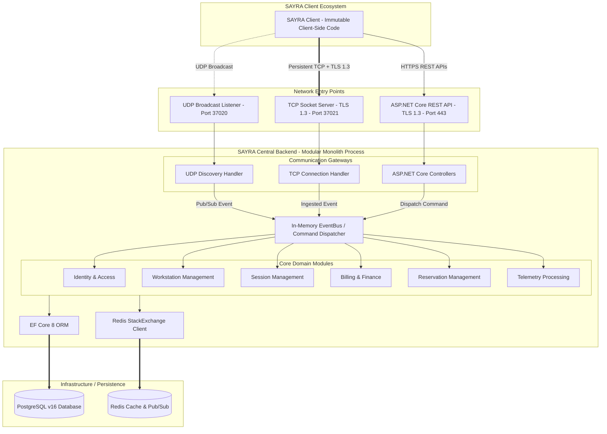
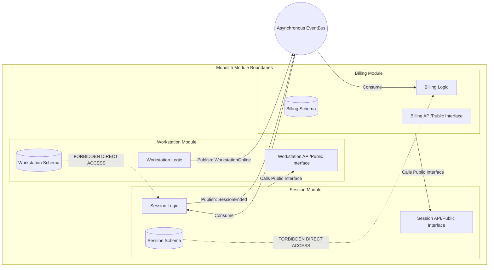

# Architectural & Deployment Diagrams

This document visualizes the high-level system architecture, module boundaries, and deployment topologies for the **SAYRA Central Backend**.

---

## 1. High-Level System Architecture Diagram

This diagram shows the complete message flow from the immutable SAYRA Client to the Central Backend and its underlying data/infrastructure layers.



---

## 2. Module Boundary Diagram

This diagram outlines how independent modules reside in the single monolith codebase, their strict public interfaces, and forbidden dependencies.



* **Core Rule**: Modules are highly decoupled. Direct cross-module database tables referencing or foreign keys are forbidden. Communication happens either asynchronously via the `SharedEventBus` or synchronously via registered `Public Interfaces` (e.g., `ISessionModuleApi`).

---

## 3. Deployment Topology Diagrams

### 3.1. Development Environment Topology
A clean, minimal, single-machine developer setup running on Windows/macOS/Linux.

```text
[ Developer Machine ]
        |
        +-- Docker Desktop / Local Runtimes
              |
              +-- [App Process] SAYRA Central Backend (Self-Hosted Console App)
              |         |
              |         +---> Ports: 37020 (UDP), 37021 (TCP), 5001 (HTTPS API)
              |
              +-- [Container] PostgreSQL v16 (Local DB port 5432)
              +-- [Container] Redis (Local Cache port 6379)
```

---

### 3.2. Staging / LAN Gaming Center Production Topology
A production-grade, highly available, and redundant setup optimized for high-performance LAN centers.

```text
                         [ LAN Gaming Client Fleet ]
                                      |
                      +---------------+---------------+
                      |               |               |
                      v (UDP Discovery)  v (TCP Persistent)  v (REST/HTTPS API)
             +-----------------+---------------+---------------+
             |                                                 |
             v                                                 v
   [ LAN Router / Switch ]                           [ Keepalived Virtual IP ]
             |                                                 |
             +-------------------------+-----------------------+
                                       |
                                       v
                     [ High-Performance NGINX Load Balancer ]
                     |      (TLS 1.3 Termination for HTTPS)  |
                     |      (TCP streams pass-through)       |
                     +-----------------+---------------------+
                                       |
                     +-----------------+-----------------+
                     |                                   | (Active/Active Load Balancing)
                     v                                   v
        [ Monolith Node 01 ]                [ Monolith Node 02 ]
         (Docker Container)                  (Docker Container)
         - Port 37020 (UDP)                  - Port 37020 (UDP)
         - Port 37021 (TCP)                  - Port 37021 (TCP)
         - Port 5001 (REST)                  - Port 5001 (REST)
                     |                                   |
                     +-----------------+-----------------+
                                       |
                     +-----------------+-----------------+
                     |                                   |
                     v                                   v
             [ Redis Cluster ]                 [ PostgreSQL Cluster ]
             - Distributed state store         - Primary DB (Active Writes)
             - Command pub/sub hub             - Replica DB (Read-Only)
             - Session lock manager            - Streaming replication
```
