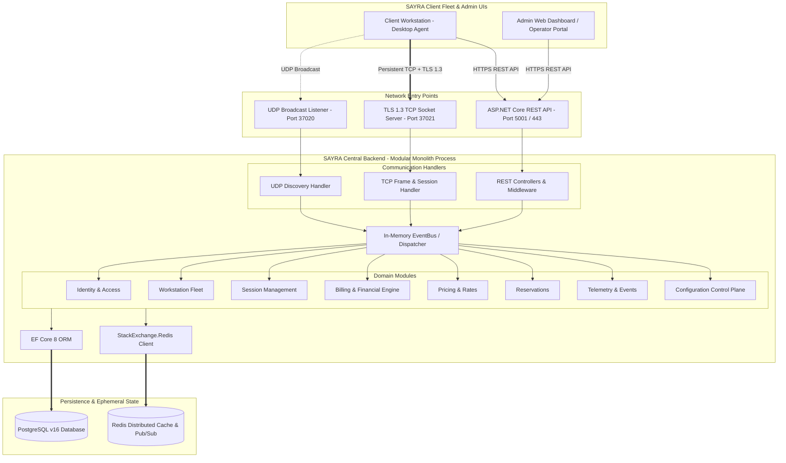
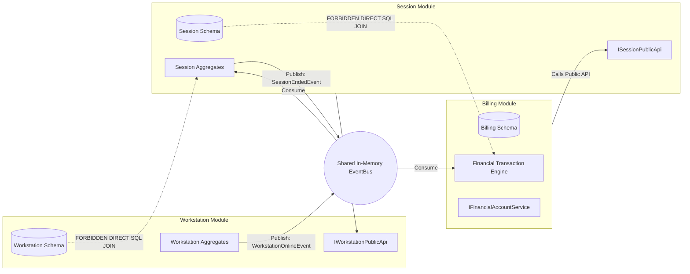

# System Diagrams

This document visualizes the high-level system architecture, module interaction rules, and deployment topologies for the **SAYRA Central Backend**.

---

## 1. System Architecture Diagram



---

## 2. Module Boundaries & Data Isolation



---

## 3. Production Deployment Topology

```text
                               ┌─────────────────────────┐
                               │ LAN Gaming Client Fleet │
                               └────────────┬────────────┘
                                            │
               ┌────────────────────────────┼────────────────────────────┐
               │                            │                            │
               ▼ (UDP Discovery)            ▼ (TCP TLS 1.3)              ▼ (HTTPS REST)
     ┌──────────────────┐         ┌──────────────────┐         ┌──────────────────┐
     │ Port 37020 (UDP) │         │ Port 37021 (TCP) │         │ Port 5001 / 443  │
     └─────────┬────────┘         └─────────┬────────┘         └─────────┬────────┘
               │                            │                            │
               └────────────────────────────┼────────────────────────────┘
                                            ▼
                         ┌────────────────────────────────────┐
                         │ NGINX / Keepalived Virtual IP      │
                         │ (TLS 1.3 Passthrough / Proxy)     │
                         └──────────────────┬─────────────────┘
                                            │
                               ┌────────────┴────────────┐
                               ▼                         ▼
                     ┌──────────────────┐      ┌──────────────────┐
                     │ Monolith Node 01 │      │ Monolith Node 02 │
                     │ (Docker Compose) │      │ (Docker Compose) │
                     └─────────┬────────┘      └─────────┬────────┘
                               │                         │
                               └────────────┬────────────┘
                                            │
                               ┌────────────┴────────────┐
                               ▼                         ▼
                     ┌──────────────────┐      ┌──────────────────┐
                     │ Redis v7 Cluster │      │ PostgreSQL v16   │
                     │ (Cache, Pub/Sub, │      │ Primary DB       │
                     │  Session State)  │      │ (ACID Ledger)    │
                     └──────────────────┘      └──────────────────┘
```
